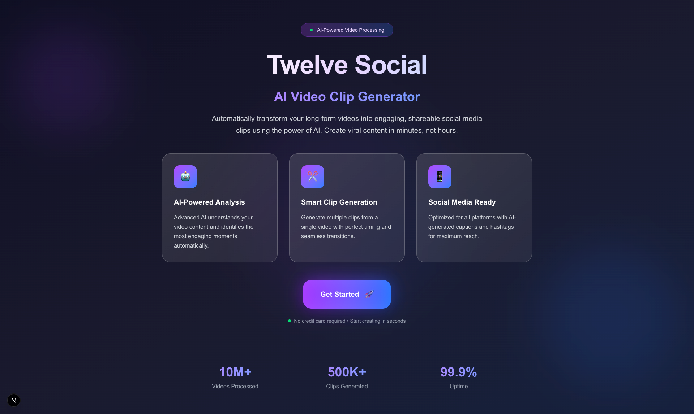
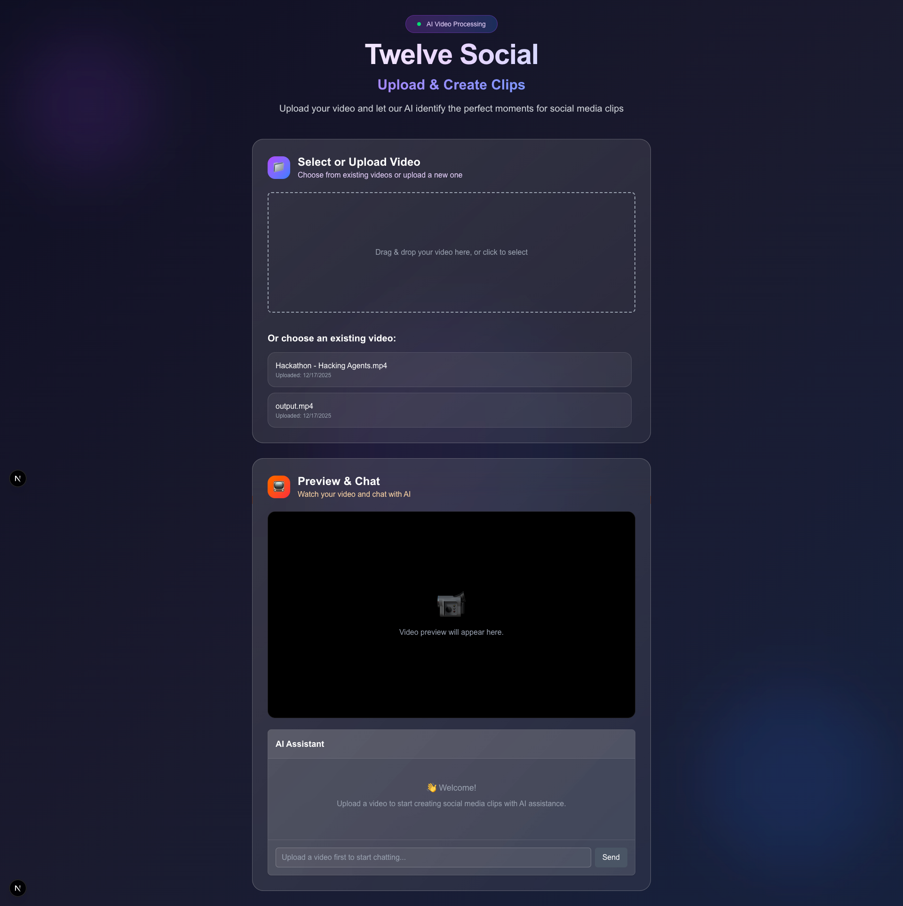
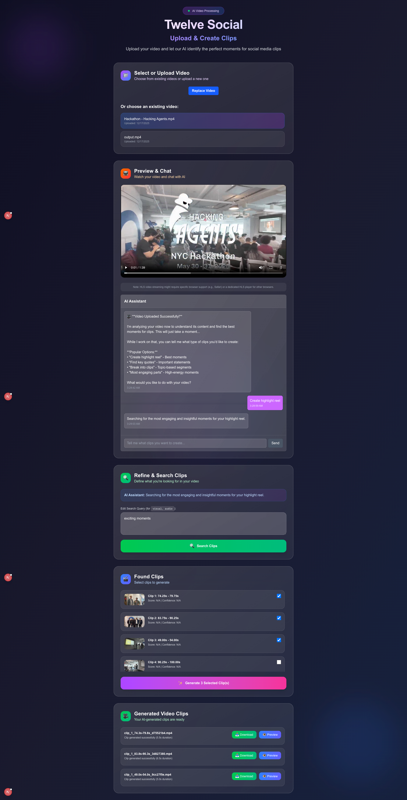

<p align="center">
  
</p>

<p align="center">
  <a href="https://www.linkedin.com/pulse/hacking-agents-hackathon-nyc-winners-showcase-langflow-ccbif">
    
  </a>
</p>

<p align="center">
  Transform long videos into engaging social media clips using AI-powered analysis and automated clip generation.
</p>

<p align="center">
  <a href="https://twelvesocial.vercel.app"><strong>Live Demo</strong></a>
</p>

## Screenshots

<p align="center">
  
</p>

<p align="center">
  
</p>

<p align="center">
  
</p>

## Features

- **Video Upload & Processing**: Upload videos and process them with Twelve Labs AI
- **AI Chat Assistant**: Conversational AI to help you find the perfect clips
- **Smart Video Search**: Find specific moments using visual, audio, and text search
- **Automated Clip Generation**: Create social media-ready clips automatically
- **Social Media Ready**: Optimized for Instagram, TikTok, YouTube Shorts, and more

## Quick Setup

### 1. Install Dependencies

```bash
npm install
```

### 2. Environment Configuration

Copy the example environment file and add your API keys:

```bash
cp .env.example .env.local
```

Edit `.env.local` and add your API keys:

```env
# Twelve Labs API Configuration
TWELVE_LABS_API_KEY=your_twelve_labs_api_key_here
TWELVE_LABS_INDEX_ID=your_twelve_labs_index_id_here
TWELVE_LABS_INDEX_NAME=your_twelve_labs_index_name_here

# OpenAI API Configuration
OPENAI_API_KEY=your_openai_api_key_here

# Langflow Configuration
LANGFLOW_REFINE_TEXT_ENDPOINT=your_langflow_endpoint_here
LANGFLOW_APPLICATION_TOKEN=your_langflow_token_here

# Optional: Twilio Configuration (for MMS sending)
TWILIO_ACCOUNT_SID=your_twilio_account_sid_here
TWILIO_AUTH_TOKEN=your_twilio_auth_token_here
TWILIO_PHONE_NUMBER=your_twilio_phone_number_here

# Optional: DigitalOcean Spaces Configuration (for file uploads)
DO_SPACES_KEY=your_do_spaces_key_here
DO_SPACES_SECRET=your_do_spaces_secret_here
DO_SPACES_ENDPOINT=nyc3.digitaloceanspaces.com
DO_SPACES_REGION=nyc3
DO_SPACES_BUCKET=your_bucket_name_here
```

**Getting API Keys:**

- **Twelve Labs**: Sign up at [twelvelabs.io](https://twelvelabs.io) and get your API key
- **OpenAI**: Get your API key from [platform.openai.com](https://platform.openai.com)
- **Langflow**: Set up your Langflow instance and get your endpoint and token
- **Twilio** (optional): Get credentials from [twilio.com/console](https://twilio.com/console)
- **DigitalOcean Spaces** (optional): Create a Space at [digitalocean.com](https://cloud.digitalocean.com/spaces)

### 3. Run the Development Server

```bash
npm run dev
```

Open [http://localhost:3000](http://localhost:3000) to start creating video clips!

## How It Works

1. **Upload Your Video**: Drag and drop or select your video file
2. **AI Processing**: Twelve Labs analyzes your video content
3. **Chat with AI**: Describe what clips you want to create
4. **Generate Clips**: AI finds and creates your perfect social media clips
5. **Download & Share**: Get your clips ready for social media

## Tech Stack

- **Frontend**: Next.js 15, React 19, TypeScript, Tailwind CSS
- **AI Services**: OpenAI GPT-4o, Twelve Labs Video AI
- **Video Processing**: Twelve Labs API, FFmpeg (planned)
- **Chat**: LangChain for conversation management

## Team

<p align="center">
  
</p>

- **Daniel Gildenbrand** - [@danschewy](https://github.com/danschewy)
- **Nolan Hu** - [@iamnolanhu](https://github.com/iamnolanhu)

## Contributing

1. Fork the repository
2. Create your feature branch (`git checkout -b feature/amazing-feature`)
3. Commit your changes (`git commit -m 'Add amazing feature'`)
4. Push to the branch (`git push origin feature/amazing-feature`)
5. Open a Pull Request

## License

This project is licensed under the MIT License.
